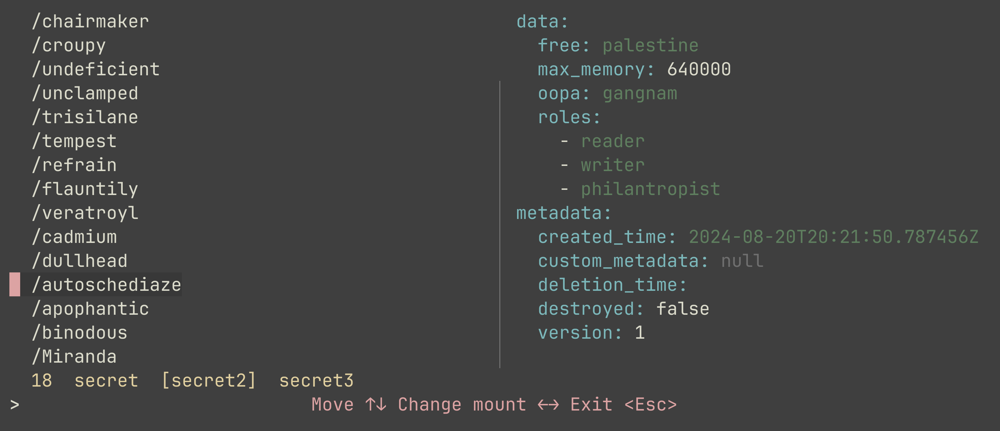

# Pole (vault)

Browse secrets in vault in the terminal.



To do it, do:

```sh
git clone https://github.com/slarwise/pole
go install
export VAULT_ADDR=https://my-vault.com
export VAULT_TOKEN=secret-token
pole
```

Filter secrets fuzzily by typing letters, navigate secrets and mounts with the arrow keys.

## Development

To start and populate a local vault server, run

```sh
go run dev-vault/main.go
```

Set the environment with

```sh
dev-vault/env.sh
```

and run `go run main.go` to test it.
