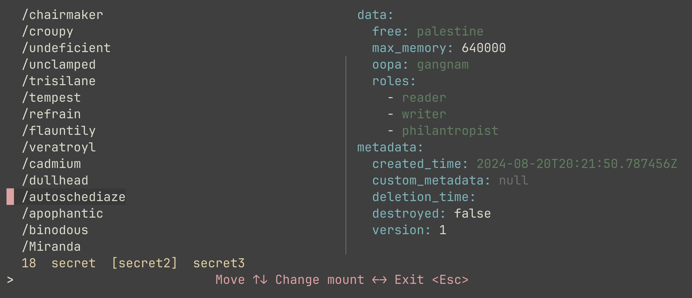

# Pole (vault)

Browse secrets in vault in the terminal.



To do it, do:

```sh
go install github.com/slarwise/pole@latest
export VAULT_ADDR=https://my-vault.com
# The vault token is taken from the VAULT_TOKEN env var or from ~/.vault-token
# Logging into vault with `vault login` stores it in ~/.vault-token by default
vault login -method oidc
pole
```

## Keybindings

To quit, press `Escape` or `c-c` (`<c-<letter>` means `Ctrl-<letter>`). Type letters to filter the secrets, delete with backspace and clear the prompt with `c-u`. `Enter` prints the secret and exits. The following actions can be bound to other keys:

| Action              | Default keybind |
| ------------------- | --------------- |
| next-secret         | `c-j`           |
| prev-secret         | `c-k`           |
| next-field          | `c-n`           |
| prev-field          | `c-p`           |
| next-mount          | `right`, `,`    |
| prev-mount          | `left`, `;`     |
| toggle-show-help    | `?`             |
| toggle-show-secrets | `c-i`           |
| open-in-browser     | `c-o`           |
| refresh-secrets     | `c-r`           |
| copy-selected-field | `space`         |

If you want to change these, put something like this in `~/.config/pole/config`. Each line is on the form `<keybind><space(s)><action>` The available named keys are `up`, `down`, `right`, `left`, `page-up`, `page-down`, `tab` and `space`. If you provide a config file, all actions must be bound, the defaults are not inherited. Different keys can be bound to the same action.

```
down      next-secret
c-j       next-secret
up        prev-secret
page-down next-field
page-up   prev-field
right     next-mount
left      prev-mount
?         toggle-show-help
tab       toggle-show-secrets
c-o       open-in-browser
c-r       refresh-secrets
space     copy-selected-field
```

## Development

Run tests with `go test ./...`. To start and populate a local vault server, run

```sh
go run dev-vault/main.go
source dev-vault/env.sh
```

and run `go run main.go` to test against it.
asdf
